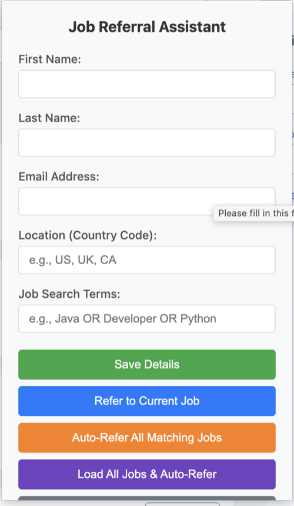

# Job Referral Assistant

A Chrome extension that helps you easily refer friends to job opportunities from your employee portal.

## Features

- Easy job referral process through browser extension
- Batch job loading and auto-referral functionality
- User-friendly popup interface
- Works with various job portal websites

## Extension Interface

The extension provides a clean, intuitive interface for managing job referrals directly from your browser.

## Installation

1. Download or clone this repository
2. Open Chrome and navigate to `chrome://extensions/`
3. Enable "Developer mode" in the top right
4. Click "Load unpacked" and select the extension directory
5. The Job Referral Assistant icon should appear in your browser toolbar

## Usage

1. Navigate to your company's job portal
2. Click the Job Referral Assistant icon in your browser toolbar
3. Use the popup interface to manage and submit job referrals
4. The extension will help automate the referral process

## Version

Current version: 1.0